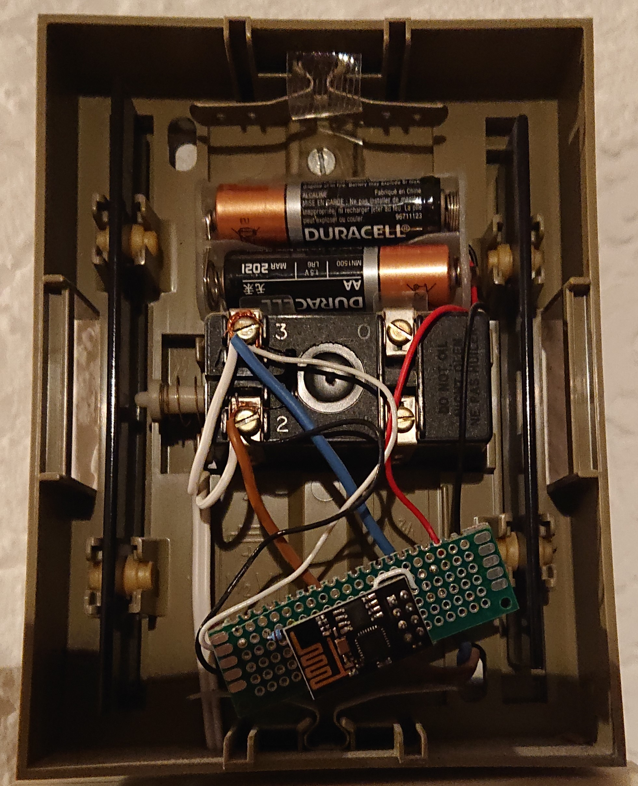

# esp8266_mqtt_doorbutton
Connects an ESP-01 to an existing doorbell and issues a message via MQTT, when someone rings.

**Wiring**

The wiring of the ESP-01 is so, that an AC voltage (~9V) of an existing wired door bell triggers a reset of the ESP-01, so that it leaves the deepsleep. The existing doorbell is connected to J1. 

The ESP-01 can operate with just 3V, so here, two AA batteries are used here.

When the ESP-01 wakes-up, it connects to a WiFi network and to an MQTT server and sends a ring message. The voltage is appended to the message so that the battery status can be monitored.

The figure blow illustrates an example deployment. 

