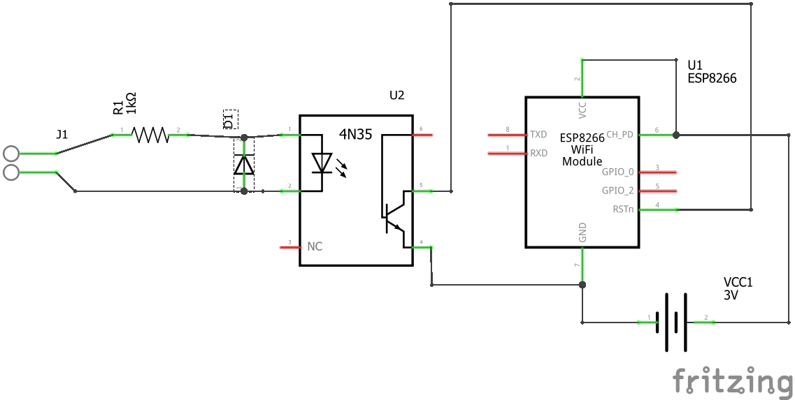

# esp8266_mqtt_doorbutton
Connects an ESP-01 to an existing doorbell and issues a message via MQTT, when someone rings.

**Wiring**

The wiring of the ESP-01 is so, that an AC voltage triggers a reset of the ESP-01, so that it leaves the deepsleep. The ESP-01 can operate with just 3V, so here, we use two AA batteries. 

